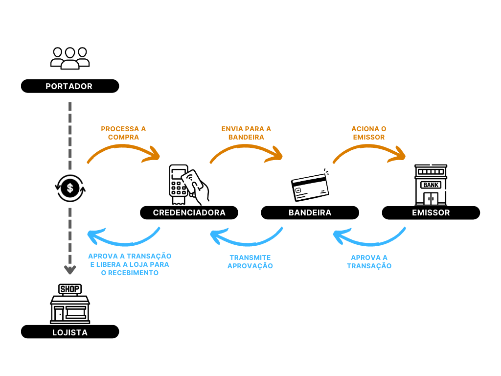

# Entendendo a indústria

## 1. Explique o fluxo de dinheiro, o fluxo de informações e o papel dos principais agentes no setor de pagamentos.

<h1 align="center">
    
     
</h1>

**Portador**: É o cliente que realiza a transação de compra utilizando o cartão como forma de pagamento no ponto de venda (POS - Point of Sale) do prestador de serviço. Ele é responsável por pagar o valor total da venda, incluindo as taxas de intermediação, a menos que o empreendedor absorva esses custos;

**Lojista**: É o empreendedor que oferece produtos ou serviços utilizando sistema de pagamento eletrônico para receber o valor da venda realizada pelor portador do cartão;

**Credenciadora (acquirer)**: São empresas que capturam o pagamento, conhecido também como banco adquirente. Eles aceitam diferentes métodos de pagamento, sendo um intermediário para todas as transações de cartão de crédito e débito. Os adquirentes gerenciam a comunicação com as bandeiras dos cartões e banco emissores para validar as informações, para poderem concluir uma transação;

**Facilitador**: As empresas facilitadoras de pagamento podem fornecer serviços semelhantes aos subadquirentes, mas eles não são as mesmas coisas. O facilitador é empresa que permite transações de pagamento eletrônico sem a necessidade de lidar diretamente com os detalhes técnicos e de segurança envolvido no processamento de pagamento. Elas atuam como intermediário entre o comprador e o vendedor, facilitando o processo de pagamento;

**Bandeira**: São empresas responsáveis por definir as regras de negócio para as compras realizadas com o cartão de crédito. Elas definem como os adquirentes devem processar as transações (cada bandeira tem seu padrão). Ela é encarregada por identificar o banco que emitiu o cartão em qualquer lugar do mundo, e também por mandar informações da compra para ser autorizada pelos emissores;

**Emissor**: Também conhecido como banco emissor, é uma instituição financeira responsável por fornecer cartões de crédito ou débito. No processo de pagamento, eles verificam se o comprador tem saldo suficiente para concluir uma compra, realizando a autorização ou a negação da transação, além de checar os fatores de segurança durante a operação. Em caso de confirmação, o emissor transfere o valor para a credenciadora, ou concede o crédito, concluindo a compra feita pelo portador do cartão;

**Regulador**: O Banco Central (BC), é o "xerife" de todos os agentes do mercado de pagamentos eletrônicos e não apenas dos bancos. Ele regulamenta e fiscaliza empresas como bandeiras de cartões ou as credenciadoras de pagamentos eletrônicos, responsável por fazer com que cada um cumpra com o seu papel dentro do fluxo de pagamento.

## 2. Explique a diferença entre acquirer, sub-acquirer e payment gateway e como o fluxo explicado na pergunta anterior muda para esses agentes.

**Acquirer (credenciadora)**: Como dito anteriormente, é o responsável pelo processamento de pagamento de uma venda por meio de um cartão dec crédito e débito, facilitando a transação entre o comerciante e o banco emissor. Encarregado pela comunicação com as bandeiras de cartão, atuando basicamente como um agente operador de cartões; 

**Sub-acquirer**: Seu papel é semelhante ao de um adquirente, mas com uma relativa facilidade. É dispensado a filiação a uma instituição bancária ou um adquirente para receber os pagamentos. A principal vantagem é seu baixo custo de implementação e facilidade de integração, por isso que são muito usadas em lojas menores. Também chamada de intermediadora, no fluxo de pagamento o lojista envia as informações da transação para o subadquirente, que encaminha esses dados para a credenciadora. Após aprovação, a subadquirente recebe o valor da venda, retirando sua comissão e encaminhando o restante para o lojista. Podendo também ser atuado em diferentes mercados e possuir parcerias com credenciadoras, permitindo mais flexibilidade;

**Payment gateway**: É uma ferramenta que é uma espécie de terminal de cartão de crédito para e-commerce, onde o cliente fornece os dados da compra na página de checkout, ou seja, é uma plataforma que irá capturar as informações do cartão e enviar para o banco emissor avaliá-lo, verificando se os dados do comprador estão seguros e se há saldo suficiente para realizar a compra. 

## 3. Explique o que são chargebacks, como eles diferem de um cancelamento e qual é a sua conexão com fraude no mundo da aquisição.

**Chargeback** é um processo pelo qual um consumidor contesta uma transação de pagamento com o emissor do cartão (instituição financeira), solicitando a devolução dos fundos. O banco, então, entra em contato com o adquirente que processou o pagamento para o ecommerce em questão com a ajuda da bandeira. Por fim, o adquirente aciona a empresa envolvida, informando-a sobre o chargeback e cobrando a quantia que deve ser devolvida ao consumidor. 
A diferença do chargeback com cancelamento, é que o cancelamento acontece de forma mais amigável. O cancelamento ocorre quando um consumidor decide cancelar uma compra e o varejista devolve o dinheiro diretamente para ele, sem a necessidade de envolver o banco, adquirente ou bandeira do cartão. 
Dessa forma, enquanto o chargeback é um processo iniciado pelo portador do cartão, muitas vezes relacionado à fraude, o cancelamento é uma iniciativa do próprio consumidor e pode ocorrer por uma variedade de motivos, sem envolver disputas entre as partes ou prejuízos financeiros para o varejista.

A reversão de pagamentos pode ocorrer por vários motivos, entre eles são:

- Produto não entregue;
- Transação não autorizada;
- Item entregue, mas não conforme descrito;
- Erro de processamento ou autorização;
- Produto apresentando defeito.

Os chargebacks estão intimamente ligados à fraude no mundo da aquisição, pois são frequentemente usados para contestar transações fraudulentas ou não autorizadas. No entanto, o uso indevido do chargeback por parte de alguns consumidores também pode ser considerado uma forma de fraude, uma vez que pode resultar em perda financeira para o estabelecimento que realizou a transação. Portanto, é importante que os comerciantes monitorem suas transações e adotem medidas de segurança para evitar fraudes e reduzir a probabilidade de chargebacks indevidos.
